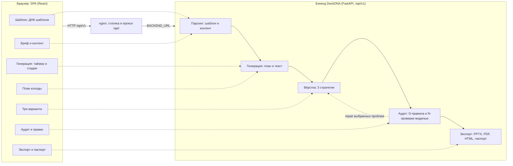

# Архитектура веб-интерфейса DeckDNA

Этот репозиторий содержит только веб-интерфейс. Парсинг шаблона, генерация, вёрстка, аудит и
экспорт выполняются на бэкенде DeckDNA (FastAPI), он лежит в отдельном репозитории команды:
https://github.com/Ranel435/LCT-prezi-2026. Фронтенд не содержит доменной логики пайплайна.
Он показывает данные API, оркестрирует вызовы и честно отмечает, чего API пока не отдаёт.

Связанные документы:

- [docs/REQUIREMENTS.md](docs/REQUIREMENTS.md): трассировка требований кейса на экраны интерфейса.
- [docs/VARIANTS.md](docs/VARIANTS.md): ось различий трёх вариантов.
- [docs/AUDIT_UI.md](docs/AUDIT_UI.md): как интерфейс показывает аудит и исправления.

## 1. Место в системе

Экраны и эндпоинты, к которым они обращаются:

| Экран (маршрут) | Слой бэкенда | Эндпоинты |
|---|---|---|
| Проекты (`/`) | — | `GET/POST /projects` |
| Шаблон (`/projects/:id/template`) | парсинг | `POST /projects/{id}/templates`, `POST /templates/{id}/analyze`, `GET /templates/{id}`, `GET /templates/{id}/design-dna` |
| Бриф и контент (`…/brief`) | парсинг контента | `POST /projects/{id}/content-packs`, `GET /content-packs/{id}` |
| Генерация (`…/runs/:runId`) | генерация, вёрстка | `POST /projects/{id}/generations`, `GET /generations/{id}`, `GET /jobs/{id}`, `POST /generations/{id}/cancel`, `/retry` |
| План (`…/runs/:runId/plan`) | генерация | `GET /generations/{id}` (поле `deck_plan`) |
| Три варианта (`…/runs/:runId/variants`) | вёрстка | `GET /generations/{id}/variants`, `GET /variants/{id}`, `GET /variants/{id}/slides`, `GET /exports/{id}`, `GET /artifacts/{id}/download` |
| Аудит (`…/runs/:runId/audit/:variantId?`) | аудит | `POST /variants/{id}/audits`, `GET /audits/{id}`, `GET /audits/{id}/issues`, `POST /audits/{id}/repairs`, `POST /issues/{id}/dismiss` |
| Экспорт (`…/runs/:runId/export/:variantId?`) | экспорт | `POST /variants/{id}/exports`, `GET /exports/{id}`, `GET /artifacts/{id}/download` |
| Панели «Провайдер моделей» и «О системе» | — | `POST/DELETE /provider-sessions`, `POST /provider-sessions/{id}/test`, `GET /version`, `GET /capabilities`, `GET /skill/manifest` |

## 2. Стек

Vite 7, React 19, TypeScript (strict), React Router 7, TanStack Query 5, openapi-fetch,
pdfjs-dist, Radix UI (dialog, switch, tabs, tooltip), CSS Modules с дизайн-токенами
(`src/app/styles/tokens.css`), светлая и тёмная темы. Шрифты интерфейса Onest и JetBrains Mono
подключены локально через `@fontsource`, без внешних CDN. Тесты: Vitest, Testing Library, MSW,
Playwright.

## 3. Слои Feature-Sliced Design

Импорты идут только сверху вниз: `app → pages → widgets → features → entities → shared`.
Каждый слайс отдаёт наружу только свой `index.ts`. Границы проверяет Steiger (`npm run lint:fsd`),
в CI эта проверка блокирующая.

| Слой | Слайс | Ответственность |
|---|---|---|
| app | `router`, `layouts`, `setup`, `styles` | маршруты с ленивой загрузкой страниц, оболочка проекта (шапка, боковой степпер), QueryClient, темы, тосты, глобальные стили и токены; запуск MSW в mock-режиме |
| pages | `projects` | список проектов, создание проекта, кнопка «Демо-сценарий» |
| | `template` | загрузка PPTX/POTX, запуск и опрос анализа, экран ДНК шаблона |
| | `brief` | форма брифа (назначение, аудитория, тон, язык, число слайдов, обязательные разделы, запрещённые утверждения), контент файлом или текстом, режим с моделью, черновик в браузере |
| | `generation` | экран прогона: таймер против бюджета 5 минут, стадии, карточки вариантов, отмена и повтор |
| | `plan` | план колоды (DeckPlan) после генерации, пересборка с теми же данными |
| | `variants` | три варианта: карточки или сравнение «слайд N во всех трёх» |
| | `audit` | выбор варианта по умолчанию, связывает `audit-workspace` и `slide-inspector` |
| | `export` | файлы варианта, паспорт качества, команда воспроизведения |
| | `not-found` | страница 404 |
| widgets | `app-header` | шапка: проект, статус прогона, провайдер моделей, «О системе», тема |
| | `project-rail` | степпер шагов и «цепочка доказательств» проекта |
| | `project-list` | таблица проектов со статусами |
| | `design-dna` | ДНК шаблона: палитра, шрифты «заявлено / на слайдах», шкала кеглей, поля и якоря, дерево мастеров, схемы макетов, роли слайдов, неподдерживаемые элементы, панель «что поняли» с конфликтами и пробелами |
| | `generation-tracker` | таймер бюджета, стадии конвейера, карточки вариантов, сообщения об ошибке |
| | `deck-plan` | таблица плана: назначение слайда, заголовок, идея, визуализация, источники |
| | `variant-board` | карточки вариантов: стратегия и её профиль, метрики, миниатюры, ссылки на файлы |
| | `variant-compare` | выравнивание слайдов трёх вариантов в одну таблицу |
| | `audit-workspace` | сводка аудита, категории, фильтры, список проблем, панель выбора, журнал, баннер повторного аудита |
| | `slide-inspector` | слайд с bbox-оверлеем, режим «до / после» |
| | `quality-passport` | паспорт качества: доказательство редактируемости, проблемы, время, версии |
| | `provider-panel` | подключение OpenAI-совместимого провайдера, проверка возможностей |
| | `about-panel` | версии сервиса, возможности API, манифест скилла, список правил аудита |
| features | `upload-template` | проверка файла (расширение, размер до 200 МБ), загрузка с прогрессом, анализ |
| | `create-project` | создание проекта |
| | `cancel-generation`, `rerun-generation` | отмена и повторный запуск прогона |
| | `select-issues` | множество выбранных проблем |
| | `repair-issues` | запуск repair и сверка результата с новым аудитом |
| | `dismiss-issue` | отклонение проблемы с причиной |
| | `export-deck` | состояние карточки файла: создать, скачать, «устарел», «скоро» |
| | `request-pdf-export` | запрос PDF для превью, если его нет |
| | `variant-files` | сведение файлов варианта (PPTX, PDF, HTML, паспорт) из экспортов |
| | `reproduce-run` | команда CLI `deckdna generate …` для воспроизведения прогона |
| entities | `project` | проекты; история прогонов и отметки прогресса в `localStorage` |
| | `template` | шаблон и Design DNA, сборка представления дизайн-системы |
| | `content-pack` | контент-пак и его сводка |
| | `generation` | прогон, job, трекер генерации, стадии, бюджет времени |
| | `variant` | варианты, слайды, метрики, каталог стратегий |
| | `audit` | аудит и проблемы, словарь правил, bbox, журнал исправлений |
| | `passport` | экспорты и разбор паспорта качества |
| | `provider-session` | сессия провайдера моделей, лимиты размера моделей |
| | `system` | `/version`, `/capabilities`, `/skill/manifest`, `/health/ready` |
| shared | `api` | типизированный клиент, ошибки, загрузка с прогрессом, ссылки на артефакты, моки |
| | `config` | маршруты, режим API, бюджет генерации 300 с, настройка тестов |
| | `lib` | `format`, `pdf` (pdf.js), `storage`, `theme`, `time` |
| | `ui` | примитивы интерфейса: Button, Badge, Card, Drawer, Segmented, PdfPage, Toast и др. |

Виджеты одного слоя не импортируют друг друга. Поэтому экран аудита собирается на уровне
страницы: `AuditWorkspace` получает функцию `renderStage`, а страница передаёт в неё `SlideInspector`.

## 4. Поток данных

### 4.1. API-клиент

- Типы запросов и ответов генерируются из OpenAPI бэкенда в `src/shared/api/schema.d.ts`
  (`npm run api:types`, по умолчанию `http://localhost:8000/openapi.json`). Копия схемы лежит в репозитории,
  поэтому сборка и тесты не требуют запущенного бэкенда.
- Запросы идут через `openapi-fetch` (`src/shared/api/client.ts`): пути, параметры и тела проверяются
  компилятором. `unwrap` превращает неуспешный ответ в `ApiError` с полями из конверта ошибки
  бэкенда: `code`, `message`, `stage`, `retryable`, `request_id`. Интерфейс показывает эти поля.
- Загрузка файлов идёт через `XMLHttpRequest` (`upload.ts`), чтобы показывать прогресс отправки.
- Все запросы относительные (`/api/v1/...`). В dev-режиме их проксирует Vite, в контейнере nginx.
  CORS не нужен.

### 4.2. TanStack Query

Настройки клиента: `staleTime` 15 с, без перезапроса при фокусе окна, до двух повторов при сбое.
Ответы 4xx не повторяются.

| Ключ | Данные | Опрос |
|---|---|---|
| `['template', id]`, `['template', id, 'dna']` | шаблон, Design DNA | анализ опрашивается каждые 1,5 с, пока идёт |
| `['generation', id]` | прогон с планом и вариантами | каждые 2 с до терминального состояния (`completed`, `failed`, `canceled`) |
| `['job', id]` | job: `state`, `stage`, `progress`, `error` | каждые 2 с до терминального состояния |
| `['variant', 'generation', runId]`, `['variant', id]` | варианты | каждые 2 с, пока есть неготовые |
| `['variant', id, 'slides']` | слайды варианта (до 200) | нет |
| `['audit', 'variant', variantId]`, `['audit', auditId, 'issues']` | аудит и проблемы (до 200) | нет, сбрасываются после repair |
| `['export', id]`, `['passport', artifactId]` | экспорты, паспорт | нет |
| `['pdf', url]` | загруженный PDF-документ | кэш 10 минут |

SSE-поток `/jobs/{id}/events` интерфейс не использует. На бэкенде он пока заглушка, а опрос
даёт те же сведения.

### 4.3. Трекер генерации: синхронный и асинхронный POST

Сейчас `POST /projects/{id}/generations` в основной ветке бэкенда синхронный. Ответ приходит
после сборки всех вариантов: без модели через секунды, с моделью через минуты. Асинхронный вариант
(202 сразу, статусы `queued → running → completed`) пока лежит в отдельной ветке бэкенда.
Трекер (`src/entities/generation/model/tracker.ts`, `useGenerationTracker.ts`) работает с обоими:

1. По кнопке «Собрать 3 варианта» трекер отправляет POST и сразу возвращает локальный идентификатор
   `local-…`. Интерфейс переходит на экран прогона и запускает таймер, не дожидаясь ответа.
2. Пока POST не вернулся, фаза `submitting`. Таймер идёт, стадии показаны без выдуманных процентов.
3. Когда пришёл ответ с `generation_id` и `job_id`, адрес заменяется на настоящий id, прогон
   запоминается в истории проекта. Дальше состояние берётся из опроса `GET /generations/{id}` и
   `GET /jobs/{id}`. При синхронном бэкенде прогон к этому моменту уже завершён. При асинхронном
   карточки вариантов меняют статус по мере готовности, а текущая стадия берётся из `job.stage`.
4. Время считается по серверным `created_at` и `finished_at`, если они есть, иначе по часам браузера.
   Бюджет 300 с задан в `src/shared/config/env.ts`.
5. Если страницу перезагрузили до ответа на POST, трекер честно сообщает, что результат этого
   запуска недоступен (`tracking_lost`).

Отмена сначала перечитывает прогон. Если он уже завершён, запрос не отправляется: в основной
ветке бэкенда отмена завершённого прогона переводит его в `canceled`.

### 4.4. Превью слайдов из PDF

Бэкенд не отдаёт PNG-превью слайдов (`GET /slides/{id}/preview` отвечает 404). Поэтому миниатюры,
сравнение вариантов и подложка для рамок аудита строятся из PDF-экспорта варианта в браузере
через pdf.js (`src/shared/lib/pdf`, `src/shared/ui/pdf-page`):

- Документ загружается один раз по URL артефакта и кэшируется. Каждая страница рисуется в canvas
  под нужную ширину с учётом `devicePixelRatio` (не больше 2). Страница рисуется, когда попадает в область видимости.
- Используется **legacy-сборка** pdfjs-dist (`pdfjs-dist/legacy/build`). Основная сборка pdfjs-dist 6
  рассчитана на самые новые браузеры и вызывает свежие API JavaScript, например
  `Map.prototype.getOrInsertComputed`. Его нет даже в Chromium 141, и превью в такой сборке падают.
  Legacy-сборка содержит полифиллы, поэтому превью работают в текущих и предыдущих версиях Chrome,
  Firefox и Safari, как требует NFR-08.
- Если PDF у варианта нет, интерфейс предлагает создать его (`request-pdf-export`). В аудите тогда
  рамки рисуются на пустом листе с правильными пропорциями.

### 4.5. Оверлей проблем

У каждой проблемы аудита есть `bbox {x, y, w, h}` в долях размера слайда, значения от 0 до 1.
Оверлей (`src/widgets/slide-inspector/ui/IssueOverlay.tsx`) — абсолютно позиционированный слой поверх
страницы PDF. Координаты переводятся в проценты (`boxStyle`), поэтому рамки не зависят от масштаба
превью. `clampBox` обрезает рамки, которые выходят за слайд: для правил вроде `layout.out_of_bounds`
это нормально. Такая рамка помечается «за краем слайда», а слишком маленькие рамки
увеличиваются до минимального видимого размера. Цвет рамки соответствует серьёзности.

### 4.6. Журнал исправлений по сигнатуре проблемы

После `POST /audits/{id}/repairs` бэкенд создаёт новую ревизию колоды и заново проверяет её. Список
проблем заменяется новым, и у проблем **другие id**. По каждой выбранной проблеме бэкенд отдаёт только
общие счётчики (`applied`, `skipped`, `failed`, …). Поэтому итог по отдельной проблеме интерфейс
определяет сам (`src/entities/audit/lib/journal.ts`):

- Сигнатура проблемы: `rule_code | slide_index | отсортированные shape_ids`. Она не меняется между ревизиями.
- Выбранные проблемы запоминаются до repair. Затем их сигнатуры сверяются с открытыми и
  нерешёнными проблемами нового аудита, с учётом количества одинаковых сигнатур. Если сигнатуры
  больше нет, проблема получает статус «исправлено», если осталась — «не удалось».
- Записи журнала (исправлено, не удалось, отклонено с причиной) и итоги каждого repair хранятся в
  `localStorage` (`deckdna.audit-journal.v1`, до 600 записей на вариант). Журнал фильтруется по
  текущей ревизии аудита.

Это обходной путь, пока бэкенд не отдаёт результат по каждой проблеме и стабильный идентификатор.
Как только они появятся, журнал будет строиться по ним.

### 4.7. Состояние на клиенте

У бэкенда нет списков прогонов проекта и сессий провайдера. Поэтому часть состояния хранится в браузере:

| Ключ | Хранилище | Что |
|---|---|---|
| `deckdna.runs.v1` | localStorage | id прогонов по проектам |
| `deckdna.evidence.v1` | localStorage | отметки «цепочки доказательств» (сгенерировано, исправлено, экспортировано, повторный аудит) |
| `deckdna.audit-journal.v1` | localStorage | журнал исправлений |
| `deckdna.provider-session.v1` | sessionStorage | id, метка, модели и срок сессии провайдера. **Токен не сохраняется** и после отправки на бэкенд не возвращается |

Черновик брифа хранится в sessionStorage, отдельно для каждого проекта.

## 5. Принцип честности

Интерфейс показывает только то, что вернул API. Если данных нет, блок скрывается или помечается
«скоро» с объяснением. Правдоподобные цифры не подставляются. Что сейчас отмечено как «скоро» или
«в разработке», потому что бэкенд этого не отдаёт:

| Возможность | Что видно в интерфейсе | Где |
|---|---|---|
| HTML-экспорт (API отвечает 501) | карточка HTML с меткой «Скоро». Включится сама, когда `/capabilities` заявит формат | Экспорт, «О системе» |
| Соответствие шаблону (`style_fidelity` в паспорте пустой) | «скоро» в карточке варианта и в паспорте | Три варианта, Экспорт |
| Правка плана до вёрстки (нет ручки «только план») | кнопки «Выше», «Ниже», «Убрать слайд», «Добавить слайд», «Сбросить правки» неактивны, у них подсказка «Скоро: правка плана до вёрстки». Работает «Пересобрать с теми же данными» | План |
| Картинка «после» repair (PDF не перерисовывается) | в режиме «до / после» справа список действий вместо картинки; предупреждение, что превью от старой ревизии | Аудит |
| PDF и паспорт новой ревизии после repair | метка «устарел» или «для новой ревизии пока не пересобирается» | Экспорт |
| Статус каждого варианта по отдельности (async) | «О системе»: «сейчас три варианта готовы вместе» | Генерация, «О системе» |
| Текущая стадия конвейера | если `job.stage` не пришёл, стадии показаны целиком без процентов, с пояснением | Генерация |
| PNG-превью слайдов | превью рисуются из PDF, в «О системе» это указано | «О системе» |
| Токены и вызовы модели (`usage`), время по стадиям | блоки паспорта скрыты, если полей нет | Экспорт |
| Разбор нескольких файлов контента | предупреждение «Не будет разобран: сейчас обрабатывается один файл» | Бриф |

Панель «О системе» (`src/widgets/about-panel`) строит список «есть / скоро» по ответу `/capabilities`,
а версии сервиса, парсера, планировщика и правил берёт из `/version` и `/skill/manifest`.

## 6. Mock-режим

`VITE_API_MODE=mock` (`npm run dev:mock` или образ с `--build-arg VITE_API_MODE=mock`) запускает в
браузере Service Worker MSW (`src/shared/api/mocks`). Он эмулирует API DeckDNA. Основа данных —
ответы, **записанные с реального бэкенда** на шаблоне из датасета без модели
(`src/shared/api/mocks/fixtures/*.json`), и PDF трёх вариантов (`public/mocks/deck-*.pdf`).
Обработчики проверяют входные данные, возвращают тот же конверт ошибок и держат состояние в памяти.
Mock-режим нужен для демо без бэкенда и для тестов.

Чем он отличается от реального бэкенда:

- Шаблон не разбирается. После загрузки любого `.pptx` или `.potx` проверяются только расширение,
  размер и сигнатура ZIP, а ДНК возвращается записанная, с новыми id.
- Генерация не выполняется. Ответ на POST приходит через 6–8 с (как синхронный бэкенд), варианты
  берутся из записи. PPTX собирается в браузере: это заглушка со структурой колоды и явной пометкой
  демо-режима, а не вёрстка по шаблону. PDF взяты из записи.
- Repair помечает выбранные проблемы исправленными на месте и сохраняет их id. Реальный бэкенд
  перепроверяет новую ревизию и выдаёт новые id. Решать, можно ли исправить проблему, помогает тот же
  список правил с обработчиком, что и в интерфейсе.
- Проверки моделью (N) имитируются: при переданной сессии провайдера добавляется эвристическая
  проблема `content.conclusion_title` для коротких заголовков. Модель не вызывается.
- Как и реальный бэкенд, mock-режим отвечает 501 на HTML-экспорт и 404 на PNG-превью.

## 7. Поставка

- `Dockerfile`: сборка в `node:22-alpine`, статика отдаётся из `nginx:1.28-alpine`. Режим API
  (`VITE_API_MODE`) задаётся при сборке.
- Адрес бэкенда `BACKEND_URL` подставляется **при старте контейнера** через envsubst
  (`docker/nginx.conf.template`), поэтому один образ подходит для всех окружений. Имя хоста
  разрешается при запросе, и SPA запускается, даже если API недоступен.
- nginx проксирует `/api/` с сохранением пути, принимает загрузки до 200 МБ без буферизации,
  держит запросы до 30 минут (синхронная генерация), отдаёт SSE без буферизации, для SPA делает
  fallback на `index.html`, кэширует хэшированные `/assets/`, выставляет CSP и security-заголовки.
  Проверка живости — `/healthz`.
- `docker-compose.yml`: сервис `web`, в профиле `backend` ещё и сервис `api`, который собирается
  из соседнего клона бэкенда.
- CI (`.github/workflows/ci.yml`, push и PR в `main`): ESLint, Steiger (FSD), `tsc`, Vitest, сборка,
  отдельно сборка Docker-образа без публикации.

## 8. Тестирование

- **Unit-тесты и тесты компонентов** (Vitest, jsdom, Testing Library): `src/**/*.test.ts(x)`, 45 файлов.
  Покрывают чистую логику (трекер и фазы генерации, стадии, bbox, сигнатуры и журнал
  исправлений, фильтры и группировку проблем, разбор паспорта и Design DNA, выбор файлов варианта,
  валидацию брифа и шаблона, команду воспроизведения, проверку размера моделей) и экраны: бриф,
  генерацию, план, варианты, аудит, карточку экспорта, панели провайдера и «О системе». Тесты
  экранов вариантов и аудита используют те же записанные фикстуры, что и mock-режим. `handlers.test.ts` проверяет, что mock-API
  отвечает по контракту: коды ошибок, 501 на HTML, repair, dismiss.
- **E2E** (Playwright, каталог `e2e/`): основной пользовательский сценарий (happy path) в Chromium,
  Firefox и WebKit. Запуск: `npm run e2e`.
- **Статические проверки**: ESLint без предупреждений, `tsc` в strict-режиме, Steiger для границ FSD.

## 9. Поддержка браузеров (NFR-08)

Целевые браузеры — актуальная и предыдущая версии Chrome, Firefox, Safari и Яндекс Браузера на
macOS и Windows, только десктоп (минимальная ширина макета 1280 px). Как это обеспечено:

- Сборка с `target: es2022`, без экспериментального синтаксиса.
- pdf.js подключён в legacy-сборке (см. 4.4).
- Шрифты подключены локально, демо не зависит от внешних CDN.
- E2E-сценарий проходит на трёх движках: Chromium (Chrome и Яндекс Браузер), Gecko (Firefox),
  WebKit (ближайшее к Safari, что есть в Playwright). Отдельных автоматических прогонов в
  Яндекс Браузере и настоящем Safari нет.
